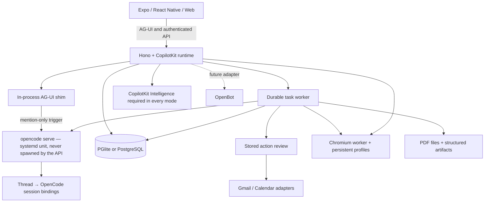

  <div align="center">

# Hive

**A personal agent with a browser, files, and work that keeps going — backed by OpenCode, summoned with a mention.**

Ask for an outcome. Follow the plan, review actions, and come back to the result.
Built with CopilotKit React Native for iOS, Android, and web.

[Quick start](#quick-start) · [Demo](#demo) · [Features](#features) · [Architecture](#architecture) · [Docs](docs/README.md) · [Contributing](CONTRIBUTING.md)

[](https://github.com/CopilotKit/OpenMuse/actions/workflows/ci.yml)
[](LICENSE)

Clone this template and customize it however you want.

**[Building on Hive? Meet with the CopilotKit team →](https://www.copilotkit.ai/openmuse)**

[](assets/demos/2026-09-16/mobile.mp4)

**[Watch the mobile demo · 38 seconds](assets/demos/2026-09-16/mobile.mp4)**

[](assets/demos/2026-09-16/web.mp4)

**[Watch the web demo · 42 seconds](assets/demos/2026-09-16/web.mp4)**

</div>

> **Alpha, for self-hosting and building on.** Open-ended reasoning, live Google accounts, and CopilotKit Rich Threads require their own configuration. See [what is verified](docs/VERIFICATION.md) and the [roadmap](ROADMAP.md).

## Demo

On iPhone, ask Hive to find interesting stories on Hacker News and summarize CopilotKit. On desktop, ask it to check the school-trip email, open the message, and research exhibits at Monterey Bay Aquarium. The agent shows email and browser results inline. **Take control** opens that same browser session when you need it.

The 38-second iPhone and 42-second desktop web demos show the current interface, framed in 16:9. The send arrow becomes a stop square inside the input pill while the agent replies, then switches back. Stopping keeps your draft intact. See the [recording notes](docs/DEMO.md) for the model setup and reproduction steps.

[Mobile MP4](assets/demos/2026-09-16/mobile.mp4) · [Web MP4](assets/demos/2026-09-16/web.mp4) · [Recording details and reproduction](docs/DEMO.md)

The [Jev aquarium-trip demo](docs/demos/jev-generative-ui.md) walks through a fictional school email, clarification choices, sourced exhibit cards, hands-on preference refinement, and a confirmed selection. [Watch the 83-second live Jev recording](assets/demos/2026-09-23/jev-live-web.mp4), where TypeSafe Jev makes the decisions and a scripted agent keeps the trip scenario repeatable. A [scripted-decision sample recording](assets/demos/2026-09-23/jev-web.mp4) is also available.

## What it is

Hive is a channel-based team chat with an agent in the loop. It runs its own server, task worker, and optional browser worker as one self-contained deployment. You can inspect and change the source under the MIT license.

Chat threads are plain conversation until you mention `@hive` — then the agent wakes with the full thread history and attached files, works as a durable OpenCode session, and asks before risky actions. Delegated tasks run as unattended OpenCode sessions and report back to the originating thread. The agent can browse public pages through the browser worker, work with files and PDFs, and run durable delegated tasks. Graphical desktops and autonomous checkout remain future work.

## Features

| Surface | What runs in this alpha |
| --- | --- |
| **Chat** | CopilotKit headless chat with streamed AG-UI events, mailbox search and reading, send/stop in one input pill, a visible follow-up queue, retained drafts, delegated tasks, and inline email, browser, PDF, plan, and finance cards. The agent only runs when mentioned (`@hive` by default); everything else is plain chat. |
| **Agent backend** | OpenCode via `AGENT_BACKEND=opencode`: one `opencode serve` process, durable thread→session bindings, a single global event stream, and an in-process AG-UI shim so the client is untouched. Permissions default to ask with approve/deny in the thread, plus per-channel/per-thread rules. |
| **Activity** | Durable task plans, progress, input requests, pause/resume/cancel/retry, approvals, and saved receipts. SQL leases recover interrupted work. |
| **Ideas** | Suggestions with source evidence; edit, accept, or dismiss. Sent replies and completed matching work are excluded. |
| **Goals & Tracking** | Goals and milestones; recurring public-page checks for changes, text availability, or USD price thresholds, with deduplicated alerts and failure backoff. |
| **Documents** | Email attachment → PDF → requested form values → filled copy → reviewed reply → receipt. Native/web PDF viewing, paging, zoom, supported fields, and sharing. |
| **Finance** | Import transaction CSV to create a spending summary with categories, transactions, and a savings-goal action. |
| **Gmail & Calendar** | Google OAuth adapters, complete mail threads, drafts/attachments, calendar discovery, and reviewed event creation/update/deletion. Live credentials required. |
| **Personal context** | Editable name, tone, avatar, and memories. Background-update preferences and durable in-app notifications. |
| **Rich Threads** | Local thread persistence on disk; optional CopilotKit Intelligence sync for thread listing, rename, archive, and replay. |

The [feature inventory](docs/FEATURES.md) describes implemented capabilities and planned extensions. Health/bank/social connectors, device push, voice, generated executable tools, and automatic reservations/payments are on the [roadmap](ROADMAP.md).

## Roadmap

Where this fork is headed — self-contained, agent-native team chat:

**Shipped**
- Single-process VM deployment: the API serves the web UI same-origin, threads/channels persist on local disk (`DATA_DIR`), Docker computer removed. See [docs/vm-deploy.md](docs/vm-deploy.md).
- OpenCode agent backend: one `opencode serve` (systemd unit on the VM; the API connects, never spawns), durable thread→session bindings, a single global event stream, and an AG-UI shim so the client is untouched.
- Permissions default to ask with approve/deny in the thread, plus per-channel/per-thread rules.
- Delegated tasks run as OpenCode sessions in auto-mode; background permission requests surface in the originating thread.
- Mention-only chat trigger: the agent runs only when the latest message contains `@hive` (env `AGENT_MENTION`); on trigger it receives the full conversation transcript plus attached files.

**Next**
- Live VM verification: end-to-end task loop with real inference, `opencode serve` systemd unit.
- Shared-computer arbitration between channel workers on the one box.
- Orchestrator queue and new-tab routing for delegated tasks.
- Multi-tenant membership: invites and roles (decisions pending). Visibility is decided: see [Who sees what](#who-sees-what).
- Browser access (deferred); native mobile against the same API.

Details and open questions live in [ROADMAP.md](ROADMAP.md).

## Quick start

**Requirements:** Node 24 LTS, pnpm 11.19.0, and a CopilotKit Intelligence project key. The local sample app needs no model or Google account.

```sh
git clone https://github.com/CopilotKit/OpenMuse.git hive
cd hive
pnpm install --frozen-lockfile
cp .env.example .env
pnpm dev
```

In another terminal:

```sh
pnpm dev:web
```

Open [localhost:8081](http://localhost:8081). The API runs at [localhost:8787/api/health](http://localhost:8787/api/health).

### Try it

1. In Chat, send **“Complete the permission slip”**. Open the task, supply fictional form values, inspect the saved PDF, and review the prepared reply. This writes only to the local mailbox.
2. In **Goals → Track**, create a built-in availability watch, then change the built-in test page to trigger an alert.
3. In **Menu → Delegate task → Finance**, use **Try example transactions** to create an interactive spending tracker.
4. Start the [browser worker](#browser-worker) and configure a model, then ask **“Check out Hacker News for cool stuff”** or **“Summarize copilotkit.ai”**. Follow the browser inline and use **Take control** to open its session. For a model-free version of this flow, follow the [AI Mock demo setup](docs/DEMO.md#run-the-agent-browser-demo).
5. With `AGENT_BACKEND=opencode` and `opencode serve` running, mention **@hive** in a thread to summon the agent; messages without a mention are plain chat.

For iOS or Android, use `pnpm --dir apps/mobile ios` or `pnpm --dir apps/mobile android`. Xcode or Android tooling is required. The PDF reader needs an Expo development build; use [native setup](apps/mobile/README.md).

## Deployment

This branch deploys as one self-contained process on a VM: the API serves the Expo web UI same-origin, threads and channels persist on local disk under `DATA_DIR`, and `opencode serve` runs as a systemd unit alongside it. Follow **[docs/vm-deploy.md](docs/vm-deploy.md)** — build/run, environment variables, a minimal reverse-proxy config, and the channel storage layout.

`render.yaml` (three services: API, web, private browser) is left over from upstream and is no longer the direction. The API still answers `/api/health` for any platform's health check.

Key variables for the VM (see the deploy doc for the full table):

| Variable | Purpose |
|---|---|
| `AGENT_BACKEND=opencode` | Routes chat through the OpenCode agent layer |
| `OPENCODE_SERVER_URL` | The systemd-managed `opencode serve` (default `http://127.0.0.1:4096`); the API connects, never spawns it |
| `OPENCODE_SERVER_PASSWORD` | Basic-auth password for `opencode serve`, if it requires one |
| `MODEL` | Single model for all sessions, e.g. `openai/gpt-5`, plus the matching provider key |
| `AGENT_MENTION` | Mention token that summons the agent in chat (default `@hive`) |
| `DATA_DIR` | Local storage root (default `.hive`); database, files, and `channels/<id>/threads/*.json` |
| `WEB_DIR` | Overrides the served web UI dir; unset/absent = headless API for native clients |
| `CPK_INTELLIGENCE_API_KEY` | Optional: enables hosted CopilotKit Rich Threads; unset = fully local thread storage |
| `HIVE_ACCESS_KEY` / `TOKEN_ENCRYPTION_KEY` | Sign-in key and at-rest encryption secret for live mode |

## Configure the agent and Google

Copy the commented settings in [.env.example](.env.example) into your private `.env`:

1. Set `AGENT_BACKEND=opencode`, `MODEL=provider/model-id`, and the matching provider key (`OPENAI_API_KEY`, `ANTHROPIC_API_KEY`, or `GOOGLE_API_KEY`). Provider keys stay on the server.
2. Run `opencode serve` as a systemd unit (see [docs/vm-deploy.md](docs/vm-deploy.md)); point `OPENCODE_SERVER_URL` at it and set `OPENCODE_SERVER_PASSWORD` if it requires auth. The API healthchecks the server and asserts a compatible version on boot — it never spawns the server itself.
3. Optionally set `AGENT_MENTION` (default `@hive`): only a message containing it as a standalone token summons the agent in chat.
4. For personal mail/calendar, set `WORKSPACE_MODE=live`, a random `HIVE_ACCESS_KEY` of at least 24 characters, and `TOKEN_ENCRYPTION_KEY` containing 32 random bytes encoded as base64. Restart the API.
5. Configure a Google OAuth web client with Gmail and Calendar APIs enabled. Set `GOOGLE_CLIENT_ID` and `GOOGLE_CLIENT_SECRET`; register `${PUBLIC_API_URL}/api/google/callback` as its redirect URI. Configure consent/test-user access in your Google project.
6. Open **Apps → Gmail** (or **Google Calendar**), connect read access, and grant write access when needed. Every send or calendar change still requires its own stored review. Changing/disconnecting the account invalidates pending connection-bound work.

`AGENT_BACKEND=model` (model-direct) and `AGENT_BACKEND=agui` (external AG-UI agent at `AGENT_URL`) remain as alternatives; `sample` keeps local fictional data on loopback.

Google credentials are encrypted at rest. File URLs and browser consoles use short-lived signatures. This deployment uses one owner protected by a shared access key; it is not a multi-tenant authentication system. Use HTTPS and restricted network access for a remote host. Keep the default local-data mode on loopback.

## Browser worker

Set `BROWSER_WORKER_URL=http://127.0.0.1:8790` and a random `WORKER_TOKEN` of at least 32 characters in `.env`.

```sh
pnpm --dir apps/worker exec playwright install chromium
pnpm dev:browser
```

Or use `docker compose --env-file .env -f infra/compose.yaml up --build -d`. The same token must reach the API and worker. Sessions have persistent Chromium profiles; the app can open a live screenshot console and import PDF downloads. Agent tools can read public pages and hand interactive work to the person. [Worker setup and boundaries](apps/worker/README.md).

## Persistence and operation

Channel workspace directories and thread bindings live on the API server's local disk under `DATA_DIR` (`channels/<channelId>/threads/<threadId>.json`), alongside the database.

### Who sees what

Hive is a team workspace. Everyone who signs in sees the same channels, threads (with the agent's replies), tasks, boards, goals, watches, and the reviews and receipts those tasks produce.

Kept per person: the **orchestrator chat** and its threads, and everything that comes from their own Google account (mail, calendar, Drive, files, drafts, browser sessions), plus their memories, agent personality, ideas and notifications.

A task is shared, but it runs as the person who asked for it: their Google account, files and browser. Anyone can pause, cancel or answer it. Only that person can approve a review it prepares, because approving acts on their account; teammates can read the review and decline it. Reviews a person prepares for themselves, outside any task, stay theirs.

Shared thread history applies to the default local thread storage. Hosted Rich Threads (`CPK_INTELLIGENCE_API_KEY`) identifies each person to CopilotKit separately, so it keeps their threads apart.

On start the server adopts anything that used to be kept per person (tasks, boards, reviews, thread transcripts), so existing work appears for the whole workspace. Orchestrator transcripts stay where they were. The kinds shared this way are listed in `SHARED_KINDS` in `apps/server/src/db.ts`.

### Application storage

By default, embedded PGlite, documents and the signing key live in `.hive/`; browser profiles live in `.hive/browser-profiles/`. Keep that directory private and back it up. The API hosts the task worker. The host must remain running for background work.

For a separate task worker, configure the same `DATABASE_URL`, secrets and shared `DATA_DIR` for both processes, then set `TASK_WORKER_ENABLED=false` on the API and run `pnpm dev:worker`. PGlite cannot be opened by separate processes. Production commands are `pnpm build:server`, `pnpm start` and `pnpm start:worker`. Run one API instance; task workers coordinate through SQL leases.

No hidden retry occurs after an uncertain external write. Review its provider outcome before creating a replacement. Pausing/cancelling prevents subsequent task steps; an already approved in-flight provider request may finish.

## CopilotKit Rich Threads (optional)

`CPK_INTELLIGENCE_API_KEY` is optional. When set (via `npx copilotkit@latest login` and `npx copilotkit@latest project select`), thread listing, rename, and archive sync through CopilotKit Intelligence. When unset, the server runs fully local: threads persist on disk under `DATA_DIR`, and the client falls back to local conversation history.

Intelligence is a separate service and is not included in this repository's MIT license. No project key is shipped. [Configuration and validation boundaries](docs/RICH-THREADS.md).

## Architecture



| Directory | Purpose |
| --- | --- |
| `apps/mobile` | Shared iOS, Android, and web UI with CopilotKit headless hooks. |
| `apps/server` | API, CopilotKit runtime, identity boundary, OpenCode agent layer, task engine, reviews, files, and persistence. |
| `apps/worker` | Token-protected Playwright browser service with persistent profiles. |
| `packages/domain` | Shared types and request validation. |
| `packages/integrations` | Google and browser protocol adapters. |
| `packages/backends` | Optional OpenBot HTTP adapter and its identity boundary. |
| `tests` | Workflow, runtime, persistence, provider-contract, and authorization tests. |

### OpenBot compatibility

Hive's native client and personal-agent workflows are independent of OpenBot. The disabled OpenBot adapter is pinned and contract-tested against upstream interfaces. Live user/session bridging and routine mapping remain future work. OpenBot's Intelligence runtime is not a raw AG-UI endpoint. [Integration contract](docs/OPENBOT-INTEGRATION.md).

## Development

```sh
pnpm lint
pnpm typecheck
pnpm test
pnpm build:server
pnpm build:web
pnpm build:ios
pnpm build:android
pnpm --dir apps/worker typecheck
pnpm test:browser
```

Platform build scripts export JavaScript/Hermes bundles; they do not produce signed app binaries. Browser checks require installed Chromium and public fixture access. See [contribution guidance](CONTRIBUTING.md) and [verification results](docs/VERIFICATION.md).

## Contributing and license

Issues and pull requests are welcome. Start with [CONTRIBUTING.md](CONTRIBUTING.md), [ROADMAP.md](ROADMAP.md), and the [security policy](SECURITY.md).

MIT licensed. Built by CopilotKit. Its original interface and fictional assets are included. Website, email, and document content supplies evidence, not permission to act.
