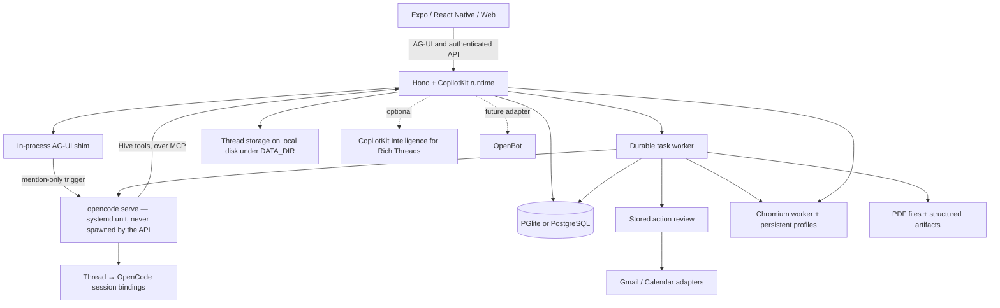

  <div align="center">

# Hive

**A team chat with a shared agent: a browser, files, and work that keeps going — backed by OpenCode, summoned with a mention.**

Ask for an outcome. Follow the plan, review actions, and come back to the result.
Built with CopilotKit React Native for iOS, Android, and web.

[Quick start](#quick-start) · [Demo](#demo) · [Features](#features) · [Architecture](#architecture) · [Docs](docs/README.md) · [Contributing](CONTRIBUTING.md)

[](https://github.com/CopilotKit/OpenMuse/actions/workflows/ci.yml)
[](LICENSE)

Clone this template and customize it however you want.

**[Building on Hive? Meet with the CopilotKit team →](https://www.copilotkit.ai/openmuse)**

[](assets/demos/2026-09-16/mobile.mp4)

**[Watch the mobile demo · 38 seconds](assets/demos/2026-09-16/mobile.mp4)**

[](assets/demos/2026-09-16/web.mp4)

**[Watch the web demo · 42 seconds](assets/demos/2026-09-16/web.mp4)**

</div>

> **Alpha, for self-hosting and building on.** Open-ended reasoning, live Google accounts, and CopilotKit Rich Threads require their own configuration. There are no roles yet: everyone who can sign in has full access ([Who sees what](#who-sees-what)). See [what is verified](docs/VERIFICATION.md) and the [roadmap](ROADMAP.md).

## Demo

On iPhone, ask Hive to find interesting stories on Hacker News and summarize CopilotKit. On desktop, ask it to check the school-trip email, open the message, and research exhibits at Monterey Bay Aquarium. The agent shows email and browser results inline. **Take control** opens that same browser session when you need it.

The 38-second iPhone and 42-second desktop web demos are framed in 16:9. The send arrow becomes a stop square inside the input pill while the agent replies, then switches back. Stopping keeps your draft intact. They were recorded on September 16 with an earlier build whose agent ran inside the API and was scripted, so they show the chat and browser flow, not how the agent runs today (OpenCode). See the [recording notes](docs/DEMO.md) for how they were made.

[Mobile MP4](assets/demos/2026-09-16/mobile.mp4) · [Web MP4](assets/demos/2026-09-16/web.mp4) · [Recording details](docs/DEMO.md)

The [Jev aquarium-trip demo](docs/demos/jev-generative-ui.md) walks through a fictional school email, clarification choices, sourced exhibit cards, hands-on preference refinement, and a confirmed selection. [Watch the 83-second live Jev recording](assets/demos/2026-09-23/jev-live-web.mp4), where TypeSafe Jev makes the decisions and a scripted agent, since removed, kept the trip scenario repeatable. A [scripted-decision sample recording](assets/demos/2026-09-23/jev-web.mp4) is also available.

## What it is

Hive is a channel-based team chat with an agent in the loop. It runs its own server, task worker, and optional browser worker as one self-contained deployment. You can inspect and change the source under the MIT license.

Chat threads are plain conversation until you mention `@hive` — then the agent wakes with the full thread history and attached files, works as a durable OpenCode session, and asks before risky actions. Delegated tasks run as unattended OpenCode sessions and report back to the originating thread. The agent can browse public pages through the browser worker, work with files and PDFs, and run durable delegated tasks. Graphical desktops and autonomous checkout remain future work.

What the agent does is the team's, not one person's. Everyone who signs in sees the same channels, threads, tasks, files, memories and Google connection, so a note on a task, a file in a channel, or something the agent was told to remember is there for the next person instead of living in one chat. Only each person's own orchestrator chat, their private tab for talking to the agent outside any channel, is private ([Who sees what](#who-sees-what)), and there are no roles yet ([roadmap](#roadmap)).

## Features

| Surface | What runs in this alpha |
| --- | --- |
| **Chat** | CopilotKit headless chat with streamed AG-UI events, mailbox search and reading, send/stop in one input pill, a visible follow-up queue, retained drafts, delegated tasks, and inline email, browser, PDF, plan, and finance cards. The agent only runs when mentioned (`@hive` by default); everything else is plain chat, except a pick on one of its choice cards, which answers its own question. |
| **Agent** | OpenCode, the only agent: one `opencode serve` process, durable thread→session bindings, a single global event stream, and an AG-UI shim in the API so the client is untouched. Permissions default to ask with approve/deny in the thread, plus per-channel/per-thread rules. Hive's own tools (mail, browser, tasks, files, choice cards) are offered to OpenCode over MCP by a bridge in the API, with credentials that last for one run. Optional choice cards (`present_choices`, Jev, off unless `JEV_MODE` is set) stay with the conversation they were asked in, so a team thread's are the team's; see the [Jev walkthrough](docs/demos/jev-generative-ui.md). |
| **Activity** | Durable task plans, progress, input requests, pause/resume/cancel/retry, approvals, and saved receipts. SQL leases recover interrupted work. Finished agent work waits **In Review** until a person marks it done or sends it back with notes; the agent never closes a task itself. See [Review and the task brief](#review-and-the-task-brief). |
| **Files** | Every channel has a **Files** button: what its agent made and what people upload, as a list of recent changes or a folder browser, with previews (images, PDF, video and audio, Markdown, spreadsheets, JSON, code, and web pages that run in a sandbox). The agent can share any file in the chat as a card (`send_file`) and ask a person for files with an upload button and modal (`request_upload`). See [Channel files](#channel-files). |
| **Ideas** | Suggestions with source evidence; edit, accept, or dismiss. Sent replies and completed matching work are excluded. |
| **Goals & Tracking** | Goals and milestones; recurring public-page checks for changes, text availability, or USD price thresholds, with deduplicated alerts and failure backoff. |
| **Documents** | Email attachment → PDF → requested form values → filled copy → reviewed reply → receipt. Native/web PDF viewing, paging, zoom, supported fields, and sharing. |
| **Finance** | Import transaction CSV to create a spending summary with categories, transactions, and a savings-goal action. |
| **Gmail & Calendar** | Google OAuth adapters, complete mail threads, drafts/attachments, calendar discovery, and reviewed event creation/update/deletion. Live credentials required. |
| **Personality & memory** | The agent's name, tone, and avatar, and what it remembers (editable and forgettable), the same for everyone on the team. Background-update preferences and durable in-app notifications. |
| **Rich Threads** | Local thread persistence on disk; optional CopilotKit Intelligence sync for thread listing, rename, archive, and replay. |

The [feature inventory](docs/FEATURES.md) describes implemented capabilities and planned extensions. Health/bank/social connectors, device push, voice, generated executable tools, and automatic reservations/payments are on the [roadmap](ROADMAP.md).

## Roadmap

Where this fork is headed — self-contained, agent-native team chat:

**Shipped**
- Single-process VM deployment: the API serves the web UI same-origin, threads/channels persist on local disk (`DATA_DIR`), Docker computer removed. See [docs/vm-deploy.md](docs/vm-deploy.md).
- OpenCode as the agent: one `opencode serve` (systemd unit on the VM; the API connects, never spawns), durable thread→session bindings, a single global event stream, and an AG-UI shim so the client is untouched. It is the only agent: the in-process model agent, the scripted sample agent and the external AG-UI agent are gone, and the API does not start without OpenCode.
- Permissions default to ask with approve/deny in the thread, plus per-channel/per-thread rules.
- Delegated tasks run as OpenCode sessions in auto-mode; background permission requests surface in the originating thread.
- Mention-only chat trigger: the agent runs only when the latest message contains `@hive` (env `AGENT_MENTION`); on trigger it receives the full conversation transcript plus attached files.
- A shared workspace: everyone who signs in sees the same channels, threads, tasks, files, memories and Google connection, and only each person's orchestrator chat is private. See [Who sees what](#who-sees-what).

**Next**
- [ ] Live VM verification: end-to-end task loop with real inference, `opencode serve` systemd unit.
- [ ] Shared-computer arbitration between channel workers on the one box.
- [ ] Orchestrator queue and new-tab routing for delegated tasks.
- [ ] **Roles.** There are none yet: everyone who can sign in can do everything, including connecting Google, approving what is sent from it, and changing the agent's settings. Next are an owner and members, who can invite or remove people, and which actions are owner-only. Until then, only let in people you trust (see [Who sees what](#who-sees-what)).
- [ ] Browser access (deferred); native mobile against the same API.

Details and open questions live in [ROADMAP.md](ROADMAP.md).

## Quick start

**Requirements:** Node 24 LTS, pnpm 11.19.0, and [OpenCode](https://opencode.ai) running as `opencode serve`: the API checks for it when it starts and stops if it cannot reach it, and the agent runs on the model you name in `MODEL`. The local sample workspace needs no Google account, and a CopilotKit Intelligence project key is optional.

```sh
git clone https://github.com/CopilotKit/OpenMuse.git hive
cd hive
pnpm install --frozen-lockfile
cp .env.example .env   # then set MODEL=provider/model-id in it
```

Start OpenCode and the API, each in its own terminal (provider keys such as `OPENAI_API_KEY` are read by `opencode serve`, so set them in the environment it runs in):

```sh
opencode serve --port 4096
pnpm dev
```

In a third terminal:

```sh
pnpm dev:web
```

Open [localhost:8081](http://localhost:8081). The API runs at [localhost:8787/api/health](http://localhost:8787/api/health).

### Try it

1. In **Menu → Delegate task → Document**, choose the school email with the permission slip and delegate it. Open the task, supply fictional form values, inspect the saved PDF, and review the prepared reply. This writes only to the local mailbox. You can also ask in Chat: **“@hive Complete the permission slip”**.
2. In **Goals → Track**, create a built-in availability watch, then change the built-in test page to trigger an alert.
3. In **Menu → Delegate task → Finance**, use **Try example transactions** to create an interactive spending tracker.
4. Start the [browser worker](#browser-worker), then mention **@hive** and ask **“Check out Hacker News for cool stuff”** or **“Summarize copilotkit.ai”**. Messages without the mention are plain chat. Follow the browser inline and use **Take control** to open its session.
5. Ask the agent to make something, such as **“@hive Write a one-page brief for our launch and share it”**: it shares the file as a card in the chat, and **Files** in the channel header shows everything it made. **“@hive Ask me for the brand guidelines”** gets you an Upload button.

For iOS or Android, use `pnpm --dir apps/mobile ios` or `pnpm --dir apps/mobile android`. Xcode or Android tooling is required. The PDF reader needs an Expo development build; use [native setup](apps/mobile/README.md).

## Deployment

This branch deploys as one self-contained process on a VM: the API serves the Expo web UI same-origin, threads and channels persist on local disk under `DATA_DIR`, and `opencode serve` runs as a systemd unit alongside it. Follow **[docs/vm-deploy.md](docs/vm-deploy.md)** — build/run, environment variables, a minimal reverse-proxy config, and the channel storage layout.

`render.yaml` (three services: API, web, private browser) is left over from upstream and is no longer the direction. The API still answers `/api/health` for any platform's health check.

Key variables for the VM (see the deploy doc for the full table):

| Variable | Purpose |
|---|---|
| `OPENCODE_SERVER_URL` | The systemd-managed `opencode serve` (default `http://127.0.0.1:4096`); the API connects, never spawns it |
| `OPENCODE_SERVER_PASSWORD` | Basic-auth password for `opencode serve`, if it requires one |
| `MODEL` | Single model for all sessions, e.g. `openai/gpt-5`, plus the matching provider key |
| `AGENT_MENTION` | Mention token that summons the agent in chat (default `@hive`) |
| `JEV_MODE` | Choice cards: `off` (default), `sample` (a scripted scorer; nothing leaves the server) or `live` (needs `TYPESAFE_API_KEY`; sends the latest message and the agent's context to TypeSafe, see [what it sends](docs/demos/jev-generative-ui.md#what-live-mode-sends-to-typesafe)) |
| `DATA_DIR` | Local storage root (default `.hive`): the database, task files, and the channel workspaces under `owners/shared/channels/<id>/` |
| `WEB_DIR` | Overrides the served web UI dir; unset/absent = headless API for native clients |
| `CPK_INTELLIGENCE_API_KEY` | Optional: enables hosted CopilotKit Rich Threads; unset = fully local thread storage |
| `WORKSPACE_MODE` | `sample` (default): fictional local data and a keyless local session, loopback only. `live`: real Google data, and people sign in with Google |
| `PUBLIC_API_URL` | The public https URL, used for the Google OAuth callback and CORS |
| `GOOGLE_CLIENT_ID` / `GOOGLE_CLIENT_SECRET` | The Google OAuth client: how people sign in, and the Gmail/Calendar connection (live mode) |
| `TOKEN_ENCRYPTION_KEY` | 32 random bytes, base64: encrypts Google credentials at rest (live mode) |

## Configure the agent and Google

Copy the commented settings in [.env.example](.env.example) into your private `.env`:

1. Set `MODEL=provider/model-id` and the matching provider key (`OPENAI_API_KEY`, `ANTHROPIC_API_KEY`, or `GOOGLE_API_KEY`). Provider keys stay on the server, and `opencode serve` is what reads them.
2. Run `opencode serve` as a systemd unit (see [docs/vm-deploy.md](docs/vm-deploy.md)); point `OPENCODE_SERVER_URL` at it and set `OPENCODE_SERVER_PASSWORD` if it requires auth. The API healthchecks the server and asserts a compatible version on boot — it never spawns the server itself.
3. Optionally set `AGENT_MENTION` (default `@hive`): only a message containing it as a standalone token summons the agent in chat.
4. For real sign-in and the team's mail and calendar, set `WORKSPACE_MODE=live` and `TOKEN_ENCRYPTION_KEY` containing 32 random bytes encoded as base64 (`openssl rand -base64 32`). Restart the API. There is no shared sign-in key: in live mode people sign in with Google (next step).
5. Configure a Google OAuth web client with Gmail and Calendar APIs enabled. Set `GOOGLE_CLIENT_ID` and `GOOGLE_CLIENT_SECRET`; register `${PUBLIC_API_URL}/api/google/callback` as its redirect URI. This client is also the only gate on who can join: Hive has no allow-list of its own, so whoever its consent screen lets through becomes a member with full access. Keep it limited to your team (for example, list them as test users).
6. Open **Apps → Gmail** (or **Google Calendar**), connect read access, and grant write access when needed. Every send or calendar change still requires its own stored review. Changing/disconnecting the account invalidates pending connection-bound work.

OpenCode is the only agent. `WORKSPACE_MODE=sample` (the default) keeps the workspace's mail, calendar and files local and fictional, on loopback, but chat and tasks still need OpenCode. A deployment that still sets `AGENT_BACKEND=opencode` keeps working; any other value stops the API with an error saying so.

Google credentials are encrypted at rest. File URLs and browser consoles use short-lived signatures. Everyone who can sign in is a member of one team that shares the workspace's Google connection (see [Who sees what](#who-sees-what)); this is not a multi-tenant system with separate accounts per customer. Use HTTPS and restricted network access for a remote host. Keep the default local-data mode on loopback.

## Browser worker

Set `BROWSER_WORKER_URL=http://127.0.0.1:8790` and a random `WORKER_TOKEN` of at least 32 characters in `.env`.

```sh
pnpm --dir apps/worker exec playwright install chromium
pnpm dev:browser
```

Or use `docker compose --env-file .env -f infra/compose.yaml up --build -d`. The same token must reach the API and worker. Sessions have persistent Chromium profiles; the app can open a live screenshot console and import PDF downloads. Agent tools can read public pages and hand interactive work to the person. [Worker setup and boundaries](apps/worker/README.md).

## Review and the task brief

**The agent never marks a task done.** When it says it has finished (`finish_task`, or a final message that ends with `TASK_COMPLETE:`) the task moves to **In Review**, a person looks at the result, and either **Mark done** (the only way agent work reaches *Done*, and the moment a goal's milestone is recorded) or **Send back with changes**, which queues the task again with their note. A run that stops without saying it is finished lands in review too, flagged as such. Documents and spending summaries are plain code with no judgment to review, so they still finish themselves (a document task finishes once you approve its reply), and watches keep running on their schedule. The agent's `update_task` tool cannot set a task to done, and neither can a `PATCH` on a worker task.

**Notes and files** are what the agent is told besides the task itself, and they belong to the task, not to a run:

- *Notes* are the team's running instructions, oldest first, each with who wrote it. Every run reads all of them (a re-run also gets its own previous result), so changes requested in review, an answer to a question, and a plain note all travel the same way. Anyone can add one; only the author can remove their own, and only before the agent has read it.
- *Files* are PDFs, images and text, Markdown, CSV or JSON files, up to 10 MB each, 10 per task and 25 MB in all, checked by their first bytes and not just their extension. They are stored under `DATA_DIR/task-files/<task id>/`, away from any workspace, and downloaded through signed links. Each run copies them into the channel workspace (`attachments/<task id>/`) and lists them in the prompt as data, never instructions. A PDF is also saved in Files, so the agent's `inspect_pdf` and `fill_pdf` can open it. The worker and the API must share `DATA_DIR`.
- *Handing an issue to the agent* is a step of its own: add the notes and files first, choose whether it gets the recent channel discussion, then confirm. The description stays as written.
- *While the agent works*, a note or file added to a running task is sent into the same session as a new message, the way a message typed into a running OpenCode session is taken up on its next step. The task row is the queue, so this works when the task runs in a separate worker process. Anything that arrives as the agent finishes is sent as a follow-up before the run is closed out; anything that cannot be sent stays marked *not read yet*, and review offers to send it.

## Channel files

A channel's **workspace** is the folder its agent works in (`DATA_DIR/owners/shared/channels/<channel>/`, the OpenCode session's working directory), so what the agent makes ends up there, and a channel has one workspace for everyone. Each person's orchestrator has a private one, under their own folder in `owners/`. The **Files** button in a channel's header (and in a thread's banner) opens it:

- *Recent* lists the latest changes anywhere in the workspace, which answers "what did the agent just make"; *Browse* walks the folders. Opening a file shows a preview that fits it, with **Open**, **Download** and **Copy path** (the path is how to point the agent at the file). **Upload** adds files to the folder you are in, or to `uploads/` from the recent list.
- Hive's own folders (`threads/` and the staged `attachments/`), hidden files (anything starting with a dot) and `node_modules` are not listed or served. Links inside the workspace are never followed, so a link the agent leaves pointing elsewhere (another channel, `/etc`, the thread bindings) shows nothing and can be neither read nor written through.
- *Previews* are drawn in place: images; PDFs in the browser's reader or the native one; video and audio with player controls (on a phone they open in the system player, since the app has no player library); Markdown rendered; CSV and TSV as a grid; JSON laid out; code and text in a code font; a **web page** in a sandboxed frame. The frame has no `allow-same-origin` and the server sends a sandbox policy, so the page's scripts run but cannot reach Hive's page, storage or sign-in. A page's link covers the folder it sits in, so the styles, scripts and images it refers to by relative path load too. Anything else is a download.
- *Links* expire after 15 minutes and carry what they are good for in the path, as `/api/agent/channels/<id>/view/<token>/<path>`: a plain file's link covers that file only, a web page's covers its folder. They need no sign-in, send `nosniff` and a sandbox policy, support `Range` requests (so video plays and skips), and take `?download=1` (save instead of show) and `?head=N` (only the first N bytes, which is what a text preview asks for). A signed link is a credential until it expires.
- Uploads are limited to 10 MB each. A name already taken is kept and the new file becomes `name (2).ext`.

The agent has two tools for it (a task run gets `send_file` but not `request_upload`, since a task cannot wait in a chat: it asks with `ask_user` and is paused, and the waiting card has an **Attach a file** button):

- **`send_file`** names a file in the workspace and the people in the chat get a card for it: an image in place, audio and video with controls, the start of Markdown, a spreadsheet, JSON or code, and a web page with a **Show preview** button, each with Open and Download. Use it instead of pasting a file's contents into a reply. Pass `content` only to create a text file as it is sent; anything that is not text is refused. The result names the file and carries no link, so a card always asks the server for a fresh one, and says plainly when the file has since been moved or deleted.
- **`request_upload`** asks a person for files: the chat shows what is needed and an **Upload** button that opens a modal (choose files, optionally limited to the kinds the agent named; one file if it asked for one). The call returns at once, because an OpenCode tool call is cut off after 30 seconds and a chat turn should end rather than wait. The files are saved in the folder the agent named (`uploads/` by default), recorded against the request (so the card shows who added what, even on a later visit), and the person's message to the agent, `@hive I've uploaded the files you asked for:` with each file's path, follows by itself. The mention is what makes the agent in a thread answer.

The agent reads what is uploaded from `uploads/` with its own file tools.

## Persistence and operation

Channel workspace directories and thread bindings live on the API server's local disk under `DATA_DIR`, alongside the database: `owners/shared/channels/<channelId>/` for a team channel, with each thread's binding at `threads/<threadId>.json`, and `owners/<person>/channels/orchestrator/` for a person's orchestrator. The files in a workspace are the agent's working files and people's uploads; back them up with the rest of `DATA_DIR`.

### Who sees what

Hive is a team workspace. Everyone who signs in sees the same channels, threads (with the agent's replies), tasks, boards, goals, watches, reviews and receipts, files, drafts, browser sessions, and the agent's memory, personality, ideas and notifications. The only thing kept per person is the **orchestrator chat**, its threads and the choice cards in them. The tasks it creates are shared like any other.

The workspace has **one Google connection** (Gmail, Calendar, Drive), so the mail, calendar and files that come through it are the team's. Anyone can connect it when there is none, grant it more access, or disconnect it; a different account can only be connected after the connected one is disconnected. Reviews run on that connection, so anyone can approve or decline one; `createdBy` only records who prepared it. Because every signed-in person can read that mailbox and approve what is sent from it, limit who can sign in to people you trust (for example the test users on your Google OAuth consent screen).

**There are no roles yet.** Everyone who signs in has the same access, and Hive keeps no member list of its own: whoever your Google OAuth client lets through is a member, and nobody can be removed from inside Hive. Any member can connect or disconnect the Google account, approve or decline what is sent from it, mark tasks done, change the agent's name, tone and memories, set permission rules, and archive channels. Owner and member roles, invites and removing people are on the [roadmap](#roadmap).

Shared thread history applies to the default local thread storage. Hosted Rich Threads (`CPK_INTELLIGENCE_API_KEY`) identifies each person to CopilotKit separately, so it keeps their threads apart.

Earlier builds kept these per person and nothing migrates them, so start a workspace from an empty `DATA_DIR`. Anyone who had connected their own Google account should remove that access in their Google account settings. The kinds shared this way are listed in `SHARED_KINDS` in `apps/server/src/db.ts`, and a test fails if a new kind of record is added without placing it.

### Application storage

By default, embedded PGlite, documents, files attached to tasks (`task-files/`) and the signing key live in `.hive/`; browser profiles live in `.hive/browser-profiles/`. Keep that directory private and back it up. The API hosts the task worker. The host must remain running for background work.

For a separate task worker, configure the same `DATABASE_URL`, secrets and shared `DATA_DIR` for both processes, then set `TASK_WORKER_ENABLED=false` on the API and run `pnpm dev:worker`. PGlite cannot be opened by separate processes. Production commands are `pnpm build:server`, `pnpm start` and `pnpm start:worker`. Run one API instance; task workers coordinate through SQL leases.

No hidden retry occurs after an uncertain external write. Review its provider outcome before creating a replacement. Pausing/cancelling prevents subsequent task steps; an already approved in-flight provider request may finish.

## CopilotKit Rich Threads (optional)

`CPK_INTELLIGENCE_API_KEY` is optional. When set (via `npx copilotkit@latest login` and `npx copilotkit@latest project select`), thread listing, rename, and archive sync through CopilotKit Intelligence. When unset, the server runs fully local: threads persist on disk under `DATA_DIR`, and the client falls back to local conversation history.

Intelligence is a separate service and is not included in this repository's MIT license. No project key is shipped. [Configuration and validation boundaries](docs/RICH-THREADS.md).

## Architecture



| Directory | Purpose |
| --- | --- |
| `apps/mobile` | Shared iOS, Android, and web UI with CopilotKit headless hooks. |
| `apps/server` | API, CopilotKit runtime, identity boundary, OpenCode agent layer, task engine, reviews, files, and persistence. |
| `apps/worker` | Token-protected Playwright browser service with persistent profiles. |
| `packages/domain` | Shared types and request validation. |
| `packages/integrations` | Google and browser protocol adapters. |
| `packages/backends` | Optional OpenBot HTTP adapter and its identity boundary. |
| `tests` | Workflow, runtime, persistence, provider-contract, and authorization tests. |

### OpenBot compatibility

Hive's native client and agent workflows are independent of OpenBot. The disabled OpenBot adapter is pinned and contract-tested against upstream interfaces. Live user/session bridging and routine mapping remain future work. OpenBot's Intelligence runtime is not a raw AG-UI endpoint. [Integration contract](docs/OPENBOT-INTEGRATION.md).

## Development

```sh
pnpm lint
pnpm typecheck
pnpm test
pnpm build:server
pnpm build:web
pnpm build:ios
pnpm build:android
pnpm --dir apps/worker typecheck
pnpm test:browser
```

Platform build scripts export JavaScript/Hermes bundles; they do not produce signed app binaries. Browser checks require installed Chromium and public fixture access. See [contribution guidance](CONTRIBUTING.md) and [verification results](docs/VERIFICATION.md).

## Contributing and license

Issues and pull requests are welcome. Start with [CONTRIBUTING.md](CONTRIBUTING.md), [ROADMAP.md](ROADMAP.md), and the [security policy](SECURITY.md).

MIT licensed. Built by CopilotKit. Its original interface and fictional assets are included. Website, email, and document content supplies evidence, not permission to act.
