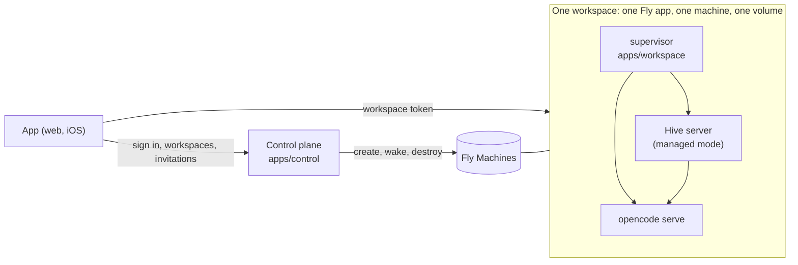

# Hosted workspaces

Hive can run as a service for many teams: people open the app, sign in once, make a workspace, invite their team and start working. Each workspace is a Hive of its own, on a machine and a disk of its own, started by a control plane. This page is how the pieces fit, how to run them on a laptop, how to deploy them to [Fly](https://fly.io), and what has not been tried on a real account.

A single team that runs its own Hive on a VM does not need any of this: see [VM deploy](vm-deploy.md).

## How it fits together



- **The control plane** (`apps/control`) knows who people are (Google sign-in), which workspaces exist, who belongs to each and in what role, and which invitations are open. It keeps that in its own database, creates and removes workspaces through a *provisioner*, and signs a short-lived **workspace token** for a person who belongs to a workspace. It serves the web app too, so there is one address to give people.
- **A workspace** (`apps/workspace`) is one image: the Hive server in managed mode and OpenCode, started by a small supervisor. It has no sign-in of its own. It trusts the control plane's public key and nothing else about who a person is.
- **The app** is the same app that opens a self-hosted workspace. A build with `EXPO_PUBLIC_CONTROL_URL` set is the hosted app: it signs in at the control plane, lists the person's workspaces, and signs in to the one they open.

### Getting into a workspace

1. The person signs in at the control plane (Google). The app keeps the control plane's session (30 days) in the keychain on a phone and in `localStorage` on the web.
2. They open a workspace. The app asks the control plane to wake it (a stopped machine is started and waited for), then for a token: `POST /v1/workspaces/:id/token`. The control plane gives one only to a member, signed with its Ed25519 key: the workspace id (audience), the person's id, email, name and role, valid for 60 seconds.
3. The app gives the token to the workspace, `POST /api/auth/managed`. The workspace checks the signature against the control plane's public key and that the token is for this workspace and was not used before, and answers with a session of its own that lasts an hour, and when it ends.
4. The app signs in again before the hour is up, and when the workspace refuses a request, without the person seeing it. A person who has been removed gets no new token, so they lose access within the hour.

A workspace never has the control plane's private key or the person's Google account, only their name, email and role. Nothing a workspace holds passes through the control plane.

### What a workspace is made of

On Fly, each workspace is **an app of its own on a private network of its own**, so a machine cannot reach another workspace's. The app has a public address (`https://<prefix>-<id>.fly.dev`) with TLS handled by Fly, an encrypted volume mounted at `/data` that holds everything (the database, channel files, the agent's sessions, the secrets below), and one machine. The free plan stops the machine when nobody is using it and Fly's proxy starts it on the next request; the team plan keeps it running.

A workspace makes its own secrets the first time it starts (`/data/secrets.json`: the key that encrypts credentials it stores, and the password the server uses to reach OpenCode). They are not passed in, so they exist nowhere else.

## Run it on a laptop

```sh
pnpm install
opencode serve --port 4096        # the agent, shared by the workspaces started below

# The app, built for the control plane's address
EXPO_PUBLIC_CONTROL_URL=http://localhost:8800 pnpm build:web

# The control plane, starting each workspace as a process on this machine
CONTROL_MODE=sample PROVISIONER=local \
CONTROL_WEB_DIR=apps/mobile/dist/web \
LOCAL_WORKSPACE_ENV='{"OPENCODE_SERVER_URL":"http://127.0.0.1:4096","MODEL":"openai/gpt-5"}' \
  pnpm exec tsx apps/control/src/index.ts
```

Open <http://localhost:8800>. A sample control plane (the default) lets anyone sign in with an email address and listens only on the loopback address; it is for trying things out. Each workspace is a Hive server on a port of its own, with its files under `.hive-control/workspaces/<id>/`. Give the model's provider key to `opencode serve` as for any Hive.

With `pnpm dev:web` instead of a build, start the control plane with `CONTROL_ALLOWED_ORIGINS=http://localhost:8081` (a sample control plane already allows it) and run `EXPO_PUBLIC_CONTROL_URL=http://localhost:8800 pnpm dev:web`.

## Deploy to Fly

You need a Fly organisation, `flyctl`, a Google OAuth client, and a model provider key.

**1. The workspace image.** Build it from the repository root, check it, and push it to a registry Fly can pull from. Fly's own registry works: create an app to hold images once, then push to it.

```sh
fly apps create hive-images          # any name that is free
docker build -f apps/workspace/Dockerfile -t registry.fly.io/hive-images:1 .
pnpm exec tsx apps/workspace/tests/run-docker.ts      # runs it as a machine would (needs Docker)
fly auth docker && docker push registry.fly.io/hive-images:1
```

`run-docker.ts` starts the image, signs a person in with a token it signs itself, checks that nothing runs as root, that the machine's settings hold none of the workspace's secrets, that it stops cleanly and that a restart keeps its data. Set `HIVE_IMAGE` to check an image you already built.

**2. Google.** Make an OAuth client of type *Web application* with the redirect URI `https://<your host>/v1/auth/google/callback`. The control plane asks for the scopes `openid email profile` only. (A workspace asks for a person's Gmail or Calendar itself, if it wants them; see [what is not built](#what-is-not-built).)

**3. The control plane.** Its image holds the server and the web app, which is built for the address people will use. Put this `fly.toml` at the repository root, with that address, and keep one machine running: it finishes workspaces that were being made when it restarted. Use a volume for its database, or set `CONTROL_DATABASE_URL` to a Postgres.

```toml
app = "hive-control"
[build]
  dockerfile = "apps/control/Dockerfile"
  [build.args]
    CONTROL_URL = "https://hive.example.com"
[http_service]
  internal_port = 8800
  force_https = true
  auto_stop_machines = "off"
  min_machines_running = 1
[mounts]
  source = "control_data"
  destination = "/data"
```

```sh
fly apps create hive-control && fly volumes create control_data -a hive-control --size 1
fly secrets set -a hive-control \
  CONTROL_MODE=live CONTROL_PUBLIC_URL=https://hive.example.com \
  CONTROL_CLIENT_IP_HEADER=Fly-Client-IP \
  GOOGLE_CLIENT_ID=… GOOGLE_CLIENT_SECRET=… \
  PROVISIONER=fly FLY_ORG=<org> FLY_IMAGE=registry.fly.io/hive-images:1 \
  FLY_API_TOKEN="$(fly tokens create org -o <org>)" \
  HIVE_WORKSPACE_ENV='{"MODEL":"openai/gpt-5","OPENAI_API_KEY":"…"}'
fly deploy
```

Point `hive.example.com` at the app (`fly certs add hive.example.com -a hive-control`), and add that address as an authorised redirect in the Google client.

**4. Try it on the real account** before anyone else does, with the spike tool:

```sh
FLY_API_TOKEN=… FLY_ORG=… FLY_IMAGE=registry.fly.io/hive-images:1 \
  pnpm exec tsx apps/control/tools/fly-spike.ts
```

It makes one workspace, then reports how long each step takes: creating it (app, addresses, volume, machine, first answer), a second `create` that must come back with the same address, signing in and keeping a channel, a request to the address after the machine was stopped (Fly's autostart), being woken by the control plane, and whether the channel survived the stop. Then it destroys the workspace and checks nothing is left. It exits non-zero if a step fails, and cleans up either way (`--keep` leaves the workspace to look at). The numbers are what to expect on your account; write them down. Failures usually name the cause: a token without rights to create apps, an organisation slug that is not the one Fly shows, an image Fly cannot pull, or a machine that starts and stops again (read `fly logs -a hive-<id>`).

### Backups

Fly snapshots a volume every day and keeps them for 60 days, which is as long as it allows. A volume lives on one host, so those snapshots are the only copy: copy them somewhere else before charging anyone. To restore, make a volume from a snapshot and start a machine on it:

```sh
fly volumes snapshots list -a hive-<id>
fly volumes create data -a hive-<id> --snapshot-id <snapshot> --region iad
```

## Configuration

### The control plane

| Variable | Meaning |
| --- | --- |
| `CONTROL_MODE` | `sample` (default): anyone signs in by email, loopback only. `live`: Google sign-in, an https address, and a host that people can reach. |
| `CONTROL_PUBLIC_URL` | Where people reach it. Invitation links are made from it and every workspace allows its origin. Must be https in live mode. Default `http://localhost:<port>`. |
| `CONTROL_PORT` / `CONTROL_HOST` | Default 8800 and 127.0.0.1 (use 0.0.0.0 in a container). |
| `CONTROL_DATA_DIR` | Its database and signing key (default `.hive-control`). |
| `CONTROL_DATABASE_URL` | A Postgres to use instead of the embedded database in the data directory. |
| `CONTROL_SIGNING_KEY` | The Ed25519 key it signs workspace tokens with (base64url PKCS8). Without it one is made on first start and kept in the data directory. Replacing the key locks every workspace out. |
| `CONTROL_WEB_DIR` | The web export to serve, from `pnpm build:web` made with `EXPO_PUBLIC_CONTROL_URL`. |
| `CONTROL_ALLOWED_ORIGINS` | Web origins besides `CONTROL_PUBLIC_URL` that may call the API; also allowed by every workspace. |
| `CONTROL_MAX_WORKSPACES` | How many workspaces one person can make (default 3). |
| `CONTROL_CLIENT_IP_HEADER` | The header the host's proxy puts the visitor's address in (`Fly-Client-IP` on Fly). Sign-in limits count per visitor, and without it every visitor looks like the proxy. |
| `GOOGLE_CLIENT_ID` / `GOOGLE_CLIENT_SECRET` | The OAuth client people sign in with. Required in live mode. |
| `PROVISIONER` | `fly` or `local`. |

### Fly (`PROVISIONER=fly`)

| Variable | Meaning |
| --- | --- |
| `FLY_API_TOKEN` | An organisation token that can create apps, volumes and machines. |
| `FLY_ORG` | The organisation's slug. |
| `FLY_IMAGE` | The workspace image, tag included. |
| `FLY_REGION` | Where workspaces run (default `iad`). |
| `FLY_APP_PREFIX` | Put before the workspace id to name its app (default `hive`). |
| `HIVE_WORKSPACE_ENV` | A JSON object of settings every workspace gets: `MODEL`, and the provider key. |
| `FLY_API_URL`, `FLY_PUBLIC_URL_TEMPLATE`, `FLY_WAIT_SECONDS` | The Machines API, where a workspace answers (`https://{app}.fly.dev`), and how long to wait for one (180). |

### Local (`PROVISIONER=local`)

`LOCAL_DIR` (where each workspace keeps its files), `LOCAL_COMMAND` and `LOCAL_CWD` (how to start one; the default runs the server from this checkout), `LOCAL_WORKSPACE_ENV` (a JSON object of settings every workspace gets: `OPENCODE_SERVER_URL`, `MODEL`), `LOCAL_WAIT_SECONDS`. A workspace gets only what it needs of the control plane's environment, so the signing key and Google secret never reach one.

### What the control plane gives each workspace

`WORKSPACE_MODE=live`, `WORKSPACE_ID`, `CONTROL_PLANE_PUBLIC_KEY`, `PUBLIC_API_URL` (its address), `ALLOWED_ORIGINS` (the control plane's, so the web app can call it), `HOST=0.0.0.0`, `PORT=8787`, `DATA_DIR=/data/hive`, and `HIVE_WORKSPACE_ENV`. The image's supervisor adds `TOKEN_ENCRYPTION_KEY` and the OpenCode password from the workspace's own secrets.

## Plans

`apps/control/src/plans.ts` is where a plan is defined: the machine, the disk, and whether the machine stops when it is idle. Every workspace is `free` today (2 shared CPUs, 4 GB, a 5 GB volume, stopped when idle); `team` is the same machine kept running with a 20 GB volume. Nothing bills yet. Fly bills a running machine by the second and a volume for as long as it exists, so a stopped workspace costs little but is not free.

## Who can do what

The control plane decides. An **owner** (who made the workspace) can invite admins and members, change roles, remove anyone, retry a workspace that failed to start, and delete it. An **admin** can invite members and remove members. A **member** can leave. Invitations are a link anyone can use (50 uses, 7 days) or one for a single email address (1 use, 7 days). A person who is not in a workspace gets "not found" for it, not "forbidden".

A workspace stores the role it was told, but does not yet use it: inside a workspace everyone who is let in can do what any member of a self-hosted Hive can (see the [roadmap](../ROADMAP.md)).

## What is not built

- **Billing.** There is no payment, and the plans are not enforced.
- **A model the platform pays for, safely.** `HIVE_WORKSPACE_ENV` puts the provider key in each workspace, where the agent's shell and any member can read it. Use a key with a spend limit, and one per workspace if you can, until the key lives in a gateway the workspaces call.
- **Gmail and Calendar in a hosted workspace.** A workspace connects Google on its own address, and an OAuth client lists a fixed set of redirect URIs, not one per workspace. It needs the connection to go through the control plane.
- **Email.** Invitations for an address are made but not sent: the control plane prints them, and the person who invites shares the link. `apps/control/src/mailer.ts` is the interface to implement.
- **Updating a running workspace to a new image.** Creating is repeatable; rolling a fix out to existing workspaces is not written.
- **Apple's rules.** Whether and how the app may sell or sign people in on iOS has not been checked, and nothing here builds a signed binary or a Mac app.
- **Roles inside a workspace, per-person limits, and cleaning up expired records** (sessions, login codes, sign-in states) in the control plane's database.

## Verification

See [Verification](VERIFICATION.md#coverage) for what the tests cover and what has only been checked against a stand-in.
